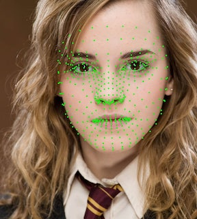
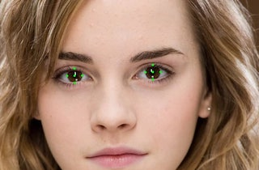

## Example of using mediapipe iris detection model for python

Feel free to use this code in your purposes

Note: a newer version of iris model build can be found here: https://hub.docker.com

----
##### All face landmarks:

##### Iris 8 landmarks:

##### Iris color estimation:
